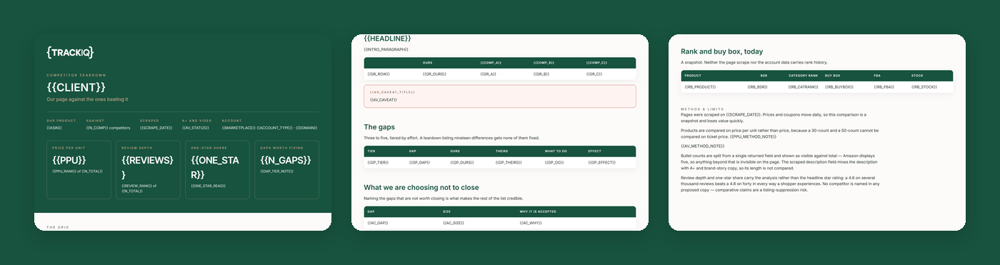

# TrackIQ: Amazon Competitor Listing Teardown

`trackiq-share-of-shelf` counts **slots**. This compares **content**.

**How does our page compare to the ones beating us, and what do we change first?**

Part of **Amazon Listing Management & Optimization** in the
[TrackIQ skills catalog](https://github.com/TrackIQ-HQ/amazon-seller-skills).

Built as an [Agent Skill](https://code.claude.com/docs/en/skills). Runs in
Claude Code, Claude web, Claude desktop and ChatGPT from the same folder.

---

## ⚠ This skill needs a scraper connection

Part of what this reads only exists on the public product page, so it needs an
**Oxylabs scraper** connection alongside the TrackIQ MCP. Scraper calls cost
credits per ASIN or keyword per run, and the skill states the run's cost in its
output.

There is no first-party substitute for the scraped fields — the skill says so
rather than approximating them.

---

## Powered by the TrackIQ MCP

[](https://trackiq.com/mcp)

This skill reads your live Amazon account through the
**[TrackIQ MCP](https://trackiq.com/mcp)** — 16 tools connecting your AI
assistant to Amazon data:

Sales & Traffic · Orders · Inventory · Returns · Sponsored Products · Sponsored
Brands · Sponsored Display · Amazon DSP · AMC Cloud · Keywords · Search Terms ·
Targeting · Search Query Performance · Organic Rank · Best Seller Rank · Buy Box
History · Brand Analytics · Export

Works with Claude, ChatGPT and Cursor. **[Get access →](https://trackiq.com/mcp)**

---

## What you get



Puts one Amazon product page side by side with the three or four beating it on the shelf — title structure, image count, bullet construction, price and price per unit, coupons, rating and review depth, and rank — then says what to change and in what order. Compares content, not slots. Use when the user asks how we compare to competitors, a competitor teardown, competitive analysis, why competitors outrank us, what competitors do better, or a listing comparison.

### The rules that keep it honest

- **A+ content and video cannot be detected**
- **`description` is not the description**
- **`bullet_points` is one newline-joined string**
- **Compare price per unit, not price**

The full list is in `SKILL.md`, and each one exists because getting it wrong
produces a confident, wrong answer rather than an obvious error.

## Requirements

- **The Oxylabs scraper**, for `get_product` and `get_reviews`. - The TrackIQ MCP, for `list_marketplaces` and `get_product_performance` — to know which of our ASINs is worth the comparison. - **A competitor set** — three to five ASINs. Ask, or take them from `trackiq-share-of-shelf`, which already identifies who holds page one. - Nothing else. No filesystem, no shell. - **Without Oxylabs:** cannot see any page. Do not guess at a competitor's listing from memory.

---

## Install

### Claude Code

```
/plugin marketplace add TrackIQ-HQ/amazon-seller-skills
/plugin install trackiq-amazon-competitor-teardown@trackiq
```

### Claude web, desktop, mobile

1. Download the `.zip` from the
   [latest release](https://github.com/TrackIQ-HQ/trackiq-amazon-competitor-teardown/releases)
2. **Settings → Capabilities → Skills** (code execution must be on)
3. **Create skill → Upload a skill**, choose the `.zip`
4. Toggle it on

### ChatGPT

Same zip. **Plugins → Skills → Create → Upload from your computer.**

---

## Setup

Answers live in `account.md`, copied from
[`assets/account.example.md`](skills/trackiq-amazon-competitor-teardown/assets/account.example.md).
**Every TrackIQ skill reads the same file**, so an account already set up for
another TrackIQ report needs nothing added.

## Delivery

Asked once and stored in `account.md`: **in-chat** (default), **file**,
**Slack**, **n8n** or **email**. Anything leaving the chat confirms with you
first and falls back to in-chat, with a note.

---

## Customizing

| File | What it controls |
|---|---|
| `checks.md` | the pre-send checks |
| `fields.md` | reference detail |
| `method.md` | the method and every threshold |
| `report-template.html` | the report shell |

---

## Contributing

```bash
python scripts/validate.py    # must exit 0 before any commit
python scripts/build.py       # writes dist/ zip + registry.json
```

Read [AUTHORING.md](https://github.com/TrackIQ-HQ/amazon-seller-skills/blob/main/AUTHORING.md)
before proposing changes.

## License

MIT. See [LICENSE](LICENSE).
